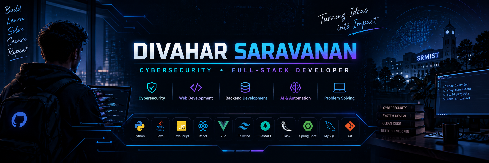

  

<h1 align="center">Hi 👋, I'm Divahar Saravanan</h1>

<h3 align="center">
Cybersecurity Student • Full-Stack Developer • Tech Enthusiast
</h3>

  

---

## 👨‍💻 About Me

- 🎓 B.Tech CSE (Cyber Security) student at **SRM Institute of Science and Technology**
- 💻 Interested in **Cybersecurity, Web Development, APIs, and Backend Development**
- 🔐 Passionate about building **secure and practical applications**
- 🚀 Always learning and working on new projects

---

## 🛠️ Technologies & Tools

---

## 🚀 Featured Projects

### 🔐 Phishing Detection System
Machine-learning based system for identifying potentially malicious phishing URLs.

### 🤖 Job Simulation System using AI Agent
A project focused on simulating job-related interactions using AI technologies.

### 🌐 Full-Stack Web Applications
Building responsive web applications with modern frontend and backend technologies.

---

## 📊 GitHub Stats

---

## 📈 Most Used Languages

---

## 🌐 Connect With Me

---

⭐ Thanks for visiting my profile!

